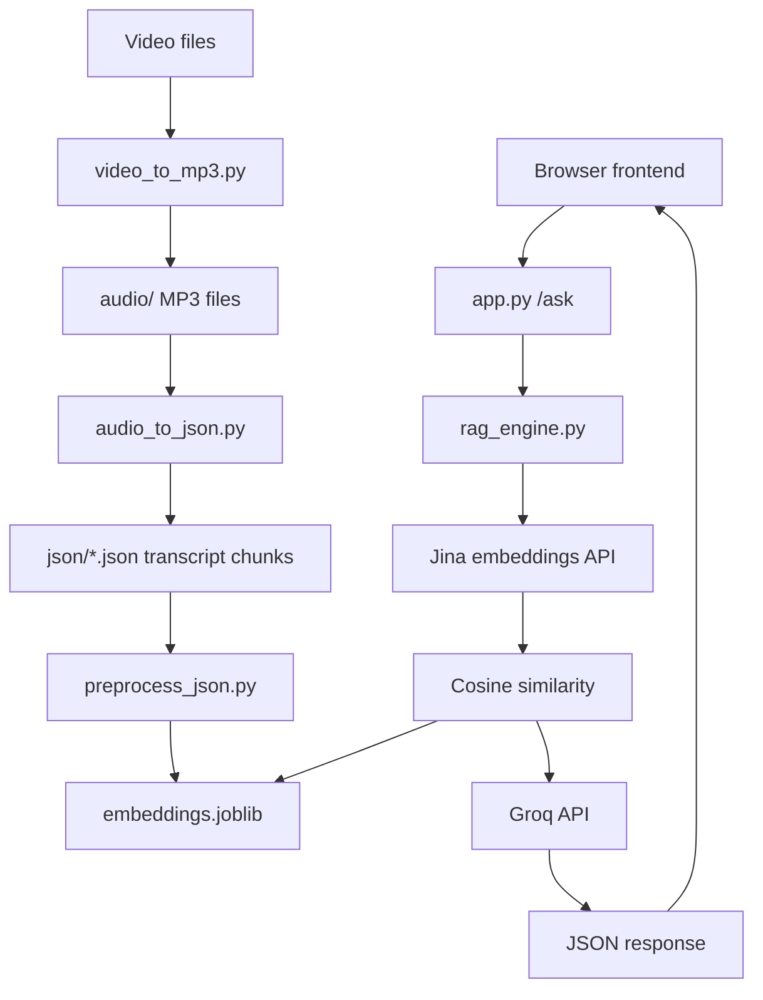

# Video RAG Teaching Assistant

[](https://fastapi.tiangolo.com/)
[](https://www.python.org/)
[](https://render.com/)
[](LICENSE)

FastAPI-based video teaching assistant that answers course questions from transcript chunks using semantic retrieval and Groq-generated responses with timestamps.

## Table of Contents

- [Features](#features)
- [Project Architecture](#project-architecture)
- [How It Works](#how-it-works)
- [Complete Pipeline](#complete-pipeline)
- [Folder Structure](#folder-structure)
- [Tech Stack](#tech-stack)
- [Installation](#installation)
- [API Endpoints](#api-endpoints)
- [Deployment on Render](#deployment-on-render)
- [Challenges Faced](#challenges-faced)
- [Screenshots](#screenshots)
- [Future Improvements](#future-improvements)
- [Project Summary](#project-summary)
- [Author](#author)
- [License](#license)
- [Contributing](#contributing)

## Features

- Answers questions about the course content.
- Retrieves the most relevant transcript chunks from `embeddings.joblib`.
- Returns timestamped sources for each answer.
- Uses the Groq API for final answer generation.
- Serves a simple browser UI through FastAPI.
- Loads the embedding index lazily for better deployment stability.

## Project Architecture



## How It Works

The project has two parts: offline preparation and online question answering. Offline scripts convert videos into audio, transcribe them into timestamped JSON chunks, and build `embeddings.joblib`. At runtime, FastAPI receives a question, `rag_engine.py` embeds it with Jina, finds the closest chunks with cosine similarity, sends the context to Groq, and returns the answer plus source timestamps.

## Complete Pipeline

Video
↓
Audio Extraction
↓
Transcription
↓
Chunking
↓
Embedding Generation
↓
Embedding Index (`embeddings.joblib`)
↓
Semantic Retrieval
↓
Groq LLM
↓
FastAPI
↓
Frontend

## Folder Structure

```text
RAG-Project/
├── README.md
├── LICENSE
├── .gitignore
└── RAG-assistance/
     ├── app.py
     ├── audio_to_json.py
     ├── preprocess_json.py
     ├── rag_engine.py
     ├── video_to_mp3.py
     ├── embeddings.joblib
     ├── requirements.txt
     ├── runtime.txt
     ├── .env.example
     ├── json/
     ├── audio/
     ├── static/
     │   └── index.html
     └── videos/
```

## Tech Stack

- Python 3.11.9
- FastAPI
- Uvicorn
- Groq API
- Jina Embeddings API
- NumPy
- Pandas
- Scikit-learn
- Joblib
- Requests
- MoviePy

## Installation

### Clone

```bash
git clone https://github.com/gaurav171023/RAG-Based-AI-Teaching--Assistant.git
cd RAG-Based-AI-Teaching--Assistant/RAG-assistance
```

### Create venv

```bash
python -m venv venv
venv\Scripts\activate
```

### Install requirements

```bash
pip install -r requirements.txt
```

### Environment Variables

Create a `.env` file in `RAG-assistance/`:

```env
GROQ_API_KEY=your_groq_api_key
JINA_API_KEY=your_jina_api_key
```

### Regenerate embeddings only if needed

Run this only if you update the transcript JSON files and need to rebuild `embeddings.joblib`:

```bash
python preprocess_json.py
```

### Run the app

```bash
python app.py
```

## API Endpoints

- `GET /` - Serves the frontend.
- `POST /ask` - Accepts `question` as form data and returns the answer plus source timestamps.

Example:

```bash
curl -X POST http://127.0.0.1:8000/ask -F "question=Where is CSS introduced?"
```

## Deployment on Render

1. Create a new Web Service on Render and connect this repository.
2. Set the root directory to `RAG-assistance`.
3. Use the Python version from `runtime.txt`.
4. Add `GROQ_API_KEY` and `JINA_API_KEY` as environment variables.
5. Build command:

```bash
pip install -r requirements.txt
```

6. Start command:

```bash
uvicorn app:app --host 0.0.0.0 --port $PORT
```

## Challenges Faced

- Memory optimization: the embedding index is loaded into a compact numeric matrix instead of a large Python object structure.
- Lazy loading: `embeddings.joblib` is loaded on demand rather than during app startup.
- Embedding optimization: query embeddings and stored embeddings are both handled as NumPy arrays for cosine similarity.
- Render deployment fixes: startup remains lightweight so the worker can serve the app reliably on a small instance.

## Screenshots

- Homepage: Add Screenshot Here
- Question submission flow: Add Screenshot Here
- Answer with timestamps: Add Screenshot Here

## Future Improvements

- Add streaming responses for a more interactive experience.
- Add cached query embeddings for repeated questions.
- Add source highlighting for the returned transcript chunks.
- Add authentication for multi-user access.

## Project Summary

### Repository Description

FastAPI video teaching assistant that retrieves relevant transcript chunks and generates grounded answers with timestamps.

### About

This repository shows a compact RAG workflow for course videos: preprocess transcript data, embed it once, and serve answers through a lightweight FastAPI app.

### GitHub Topics

- fastapi
- python
- rag
- groq
- semantic-search
- jina-ai
- render
- educational-tech

### LinkedIn Project Description

Built a FastAPI-based video teaching assistant that answers course questions from transcript chunks using semantic retrieval, timestamped sources, and Groq-generated responses.

### Resume-Ready Summary

- Built a video-based RAG assistant that answers course questions from timestamped transcript chunks.
- Implemented a FastAPI endpoint that accepts form-based questions and returns grounded JSON responses.
- Optimized deployment stability by using lazy loading and compact numeric embeddings.
- Prepared the project for Render deployment with environment-based configuration and a simple startup command.

### Elevator Pitch

I built a video teaching assistant that lets users ask natural-language questions about a course and receive grounded, timestamped answers. The system uses FastAPI, Jina embeddings, cosine similarity, and Groq to retrieve the right transcript context and generate the final response.

### Interview Questions

1. How does the app find the right context?

    It embeds the question, compares it with the stored transcript embeddings using cosine similarity, and passes the top matches to Groq.

2. Why use `embeddings.joblib` as a file-based index?

    The project is small enough to work well with a file-based embedding index, which keeps the deployment simple.

3. What made the Render deployment sensitive to memory use?

    The stored embeddings were originally loaded as Python objects, which are much heavier in memory than the file size suggests.

4. Why load the embeddings lazily?

    It keeps startup lightweight and avoids unnecessary memory pressure until a user actually asks a question.

5. What would you improve next?

    I would add cached retrieval, source highlighting, and streaming responses.

## Author

Gaurav A. ([gaurav171023](https://github.com/gaurav171023))

## License

This project is licensed under the MIT License. See [LICENSE](LICENSE).

## Contributing

Contributions are welcome if they keep the current architecture intact. Please open an issue or pull request for documentation improvements, deployment notes, or small fixes.


During deployment on Render, the application initially returned 502/503 errors because the embedding index was loaded as Python object arrays, causing excessive memory usage during the first retrieval request. The issue was resolved by loading embeddings into a compact float32 NumPy matrix while keeping metadata separate, significantly reducing runtime memory usage without changing the retrieval pipeline.


Videos
   ↓
Extract Audio
   ↓
Groq Whisper API
   ↓
Chunked JSON
   ↓
Jina Embeddings API (one-time preprocessing)
   ↓
embeddings.joblib
   ↓
────────────────────────────────────
User Question
   ↓
SentenceTransformer (query embedding)
   ↓
Cosine Similarity
   ↓
Top Relevant Chunks
   ↓
Groq Llama 3.1
   ↓
Answer + Video Timestamp